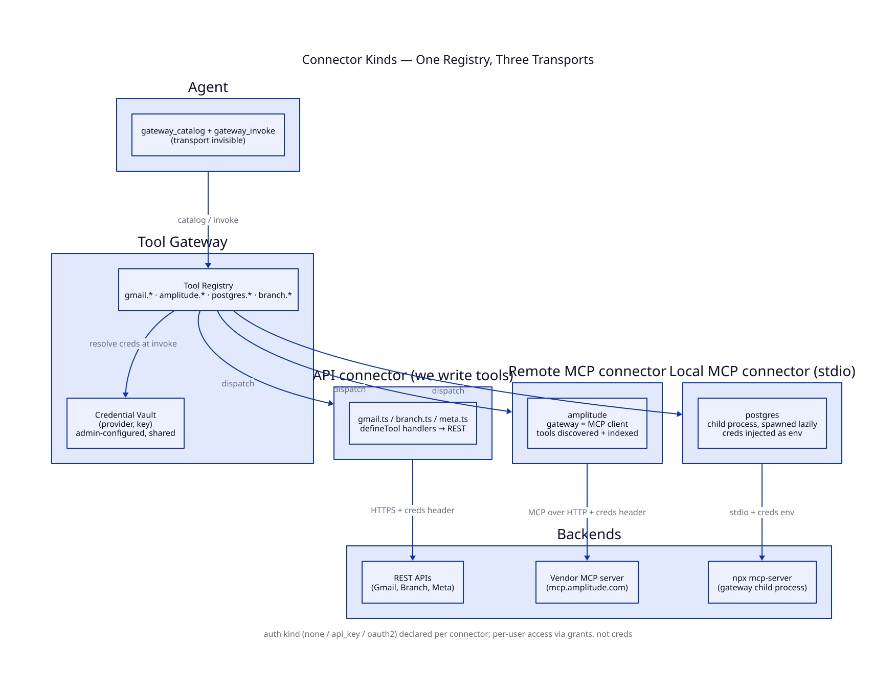

# Project Gilly — Gateway Connectors & Auth

**Every custom connector is described by two independent axes: transport (how the gateway reaches the backend) and auth kind (how it authenticates). An admin configures a connector once and everyone uses it. Who may call which tools is a separate question, answered by grants, never by credential ownership.**

See [`gateway.md`](gateway.md) for the gateway itself. This doc locks how external services get connected to it.

---

## Custom transport — three kinds, one registry

- **API** — REST/GraphQL services we write tools for (`defineTool` handlers): Branch, Meta, and
  Gilly's internal management API.
- **Remote MCP** — a vendor-hosted MCP server (Amplitude). The gateway is the MCP client: it connects, lists tools, and indexes them under the connector's namespace (`amplitude.query_dataset`). Discovery is cached briefly in-process; unavailable providers are omitted until the next refresh.
- **Local MCP (stdio)** — an MCP server the gateway spawns as a child process (`npx …`). Spawned lazily on first call, kept alive, restarted on crash.

`gateway_catalog` / `gateway_invoke` look identical for all three — the transport is invisible above the registry.



```typescript
// API connector — we write the tools
defineConnector({
  name: "gmail",
  auth: { kind: "oauth2", ... },
  tools: [searchThreads, sendEmail, ...],
});

// Remote MCP — tools discovered, not written
defineMcpConnector({
  name: "amplitude",
  transport: { kind: "http", url: "https://mcp.amplitude.com/mcp" },
  auth: { kind: "api_key", inject: c => ({ Authorization: `Bearer ${c.pat}` }) },
});

// Local MCP — child process, creds as env
defineMcpConnector({
  name: "postgres",
  transport: { kind: "stdio", command: ["npx", "-y", "@modelcontextprotocol/server-postgres"],
               env: c => ({ DATABASE_URL: c.database_url }) },
});
```

## Custom connector auth — three kinds

- **`none`** — local MCP servers that touch nothing sensitive.
- **`api_key`** — admin pastes key(s) into the web UI → vault. Injected as headers (remote MCP / API) or env (stdio). Covers Amplitude PAT, Branch key/secret — no machinery.
- **`oauth2`** — standard authorization-code + refresh, the only real build. Admin connects once:

```text
Web UI "Connect" (admin) → /oauth/{provider}/start
  → provider consent → /oauth/{provider}/callback → exchange code
  → token set (access, refresh, expiresAt) stored as one JSON value in the vault
At invoke: resolve creds → expired? refresh + persist → inject into ctx
```

App-level OAuth client id/secret (registered once with Google/Meta) live in gateway config, not the vault. No generic grant-type abstraction — authorization-code + refresh only, until a provider forces more.

Composio toolkits do not use this custom OAuth implementation. The Tools page starts a hosted
Composio Connect Link for the shared Gilly identity, and Composio owns the downstream tokens.

## Credentials are shared; access is per-user

One credential per provider — the vault stays exactly as [`gateway.md`](gateway.md) defines it: `credentials(provider, key, value)`. All calls to a provider run as the identity the admin connected.

Per-user control is **access resolution, not credential ownership**: the agent's exact `gatewayTools` determine catalog visibility, while the `grants` table decides which user may invoke each tool through the run token ([`identity-and-access.md`](identity-and-access.md)). A user without a grant can discover the tool but cannot execute it or receive its data.

Composio-managed connections follow the same shared-identity rule. Gilly keeps the Composio project key; Composio keeps downstream OAuth/API credentials. Composio remains behind the gateway and does not replace Gilly's tool allowlists, grants, result limits, or traces.

**Missing credential is a first-class answer, not a failure.** Static tools with missing credentials return `{ error: "not_connected" }`. Dynamic MCP/Composio tools are absent from current discovery, so stale selections fail closed as `forbidden` until the provider reconnects and discovery refreshes. Configuration lives with the admin, not in-conversation.


## What This Adds to the Build

1. `transport` + `auth` descriptors on `Connector` in gateway-kit — types plus two injection points.
2. MCP client wrapper (http + stdio) with tool indexing — the real work of this phase.
3. Admin-only OAuth routes (`/oauth/:provider/start`, `/callback`) + refresh-on-invoke — one focused module.
4. `not_connected` structured error — tiny.
